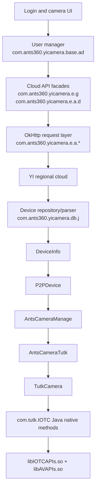

# APK architecture and analysis scope

## Artifact

| Property | Value |
|---|---|
| Input | `YI Home .apk` |
| SHA-256 | `776967311D74F2AC94FC91D3FA7AEDEA16B2023DAF9D14468931FA13EEF4F227` |
| Package | `com.ants360.yicamera.international` |
| App name | YI Home |
| Version | `5.6.5_20220819031350` |
| Version code | `319` |
| SDK | min 21, target 30, compiled with 30 |
| Main activity | `com.ants360.yicamera.activity.SplashActivity` |
| DEX files | 4 |
| Target model | `yunyi.camera.y20` |
| Target server model | `6` |

The APK was treated as read-only. Its hash was taken before extraction; no APK rewriting, resigning, or runtime patching was performed. Static analysis used ZIP extraction, JADX 1.5.6, manifest/resource parsing, and ELF symbol inspection. JADX reported 49 method-level decompilation errors among 7,452 source classes, so important conclusions were cross-checked across callers, request builders, constants, and JNI exports.

In these documents, **PROVEN** means directly represented by code or an APK asset. **UNKNOWN** means the APK does not prove the requested fact. No live cloud request was made during this phase.

## Relevant layers



## Principal classes

| Responsibility | Class/file | Relevant behavior |
|---|---|---|
| Login UI | `activity.login.UserLoginActivity`, `LoginPlatform*Activity` | Validates input and calls the user manager. |
| Logged-in user state | `base.ad`, `bean.ab` | Parses login data and retains `userid`, `token`, and `token_secret`. |
| Legacy API facade | `e.g` (extends `e.d`) | Builds login, QR authorization, and other v4 calls. |
| Reactive API facade | `e.a.d` | Builds login, device list, PIN/password, and other calls. |
| Region state | `b.d` | Loads `assets/locale.json`, selects country/server, and supplies header locale. |
| Host routing | `c.c`, `e.a.c` | Maps region to gateway and legacy direct API hosts. |
| HTTP request construction | `e.a.b.a`, `e.a.b.b` | Constructs GET/POST/PUT requests and the five explicit headers. |
| Password transform | `util.aa` | Login password HMAC-SHA256 and Base64. |
| API HMAC | `util.q`, `e.d.a(LinkedHashMap, key)` | HMAC-SHA1 and Base64 over insertion-ordered canonical parameters. |
| Device parsing | `db.j.a(JSONArray)` | Converts `/v4/devices/list` objects into `DeviceInfo`. |
| Model mapping | `feature.b`, `bean.DeviceInfo` | Maps cloud `model`/`did` to a local feature model. |
| P2P descriptor | `bean.DeviceInfo.c`, `sdk.P2PDevice` | Copies cloud values into the connection descriptor. |
| P2P factory | `sdk.AntsCameraManage` | Selects TUTK, Langtao, or TNP using `P2PDevice.type`. |
| TUTK adapter | `sdk.AntsCameraTutk` | Starts/stops live video and converts commands to TUTK IOCTRL messages. |
| TUTK implementation | `com.tutk.IOTC.TutkCamera` | Creates IOTC/AV sessions and receives compressed frames. |
| IOCTRL definitions | `com.tutk.IOTC.AVIOCTRLDEFs` | Numeric commands and request/response payload parsers. |
| Frame encryption | `camera.util.AntsUtil`, `AESIPC` | Nonce authentication and encrypted I-frame block decryption. |

## Target-model feature asset

`assets/feature_config/config_y20.json` proves the following for the target:

| Key | Value |
|---|---:|
| `model` | `yunyi.camera.y20` |
| `serverModel` | `6` |
| `deviceType` | `1` |
| `platform` | `0` |
| `h265Support` | `0` |
| `onlineStatusP2p` | `1` |
| `usingYiServer` | `1` |
| `audioMode` | `2` |

The feature manager loads every JSON file in `assets/feature_config`. For ordinary numeric cloud models it records `serverModel -> model`; therefore a device-list `model` value of `6` resolves to `yunyi.camera.y20`. A textual value beginning `Y20` is also normalized to this model by `DeviceInfo.b(model, did)`.

## Native libraries

| APK path | ELF | Size (bytes) | Direct dependencies of interest |
|---|---|---:|---|
| `lib/arm64-v8a/libIOTCAPIs.so` | AArch64, ELF64 | 334,040 | libc, libm, libstdc++, libdl, liblog |
| `lib/arm64-v8a/libAVAPIs.so` | AArch64, ELF64 | 210,616 | `libIOTCAPIs.so`, `libsCHL.so` |
| `lib/armeabi-v7a/libIOTCAPIs.so` | ARM, ELF32 | 210,832 | libc, libm, libstdc++, libdl, liblog |
| `lib/armeabi-v7a/libAVAPIs.so` | ARM, ELF32 | 148,952 | `libIOTCAPIs.so`, `libsCHL.so` |
| `lib/armeabi-v7a/libIOTCAPIsT.so` | ARM, ELF32 | 305,040 | libc, libm, libstdc++, libdl, liblog |
| `lib/armeabi-v7a/libAVAPIsT.so` | ARM, ELF32 | 165,336 | `libIOTCAPIsT.so`, `libsCHLT.so` |

The `T` variants exist only for ARMv7. No Java call to `System.loadLibrary("IOTCAPIsT")` or `System.loadLibrary("AVAPIsT")` was found. The active wrappers load only `IOTCAPIs` and `AVAPIs` in static initializers.

The ordinary libraries export both the C SDK functions and name-based JNI entry points. Confirmed JNI exports include:

| Java declaration | Exported JNI symbol |
|---|---|
| `IOTCAPIs.IOTC_Initialize2(int)` | `Java_com_tutk_IOTC_IOTCAPIs_IOTC_1Initialize2` |
| `IOTCAPIs.IOTC_Get_SessionID()` | `Java_com_tutk_IOTC_IOTCAPIs_IOTC_1Get_1SessionID` |
| `IOTCAPIs.IOTC_Connect_ByUID_Parallel(String,int)` | `Java_com_tutk_IOTC_IOTCAPIs_IOTC_1Connect_1ByUID_1Parallel` |
| `IOTCAPIs.IOTC_Session_Check_Ex(int,St_SInfoEx)` | `Java_com_tutk_IOTC_IOTCAPIs_IOTC_1Session_1Check_1Ex` |
| `AVAPIs.avClientStart2(...)` | `Java_com_tutk_IOTC_AVAPIs_avClientStart2` |
| `AVAPIs.avSendIOCtrl(...)` | `Java_com_tutk_IOTC_AVAPIs_avSendIOCtrl` |
| `AVAPIs.avRecvIOCtrl(...)` | `Java_com_tutk_IOTC_AVAPIs_avRecvIOCtrl` |
| `AVAPIs.avRecvFrameData2(...)` | `Java_com_tutk_IOTC_AVAPIs_avRecvFrameData2` |
| `AVAPIs.avClientStop(int)` | `Java_com_tutk_IOTC_AVAPIs_avClientStop` |

The C exports also include `IOTC_Connect_ByUID`, `IOTC_Connect_ByUIDEx`, `IOTC_Connect_ByUID_Parallel`, `avClientStart`, `avClientStart2`, `avRecvFrameData`, `avRecvFrameData2`, and `avSendIOCtrl`. This is a direct Java/JNI integration, not reflection or a private intermediary JNI library.

Export counts (including internal helper symbols and globals) are:

| Library | arm64-v8a | armeabi-v7a |
|---|---:|---:|
| `libIOTCAPIs.so` | 547 | 606 |
| `libAVAPIs.so` | 359 | 418 |
| `libIOTCAPIsT.so` | not packaged | 607 |
| `libAVAPIsT.so` | not packaged | 418 |

The public IOTC surface visible in the ordinary and `T` variants includes the following families (the libraries also expose lower-level/internal symbols):

```text
IOTC_Initialize, IOTC_Initialize2, IOTC_DeInitialize
IOTC_Get_SessionID, IOTC_Connect_ByUID, IOTC_Connect_ByUIDEx
IOTC_Connect_ByUIDNB, IOTC_Connect_ByUID_Parallel
IOTC_Connect_ByUID_ParallelNB, IOTC_Connect_Stop, IOTC_Connect_Stop_BySID
IOTC_Session_Check, IOTC_Session_Check_Ex, IOTC_Session_Close
IOTC_Session_Read, IOTC_Session_Write, IOTC_Session_Get_Free_Channel
IOTC_Session_Channel_ON, IOTC_Session_Channel_OFF
IOTC_Get_Version, IOTC_Get_Nat_Type, IOTC_Get_Device_Status
IOTC_Lan_Search, IOTC_Lan_Search2, IOTC_Lan_Search2_Ex
IOTC_Set_Master_Region, IOTC_Set_Max_Session_Number
IOTC_Set_Partial_Encryption, IOTC_TCPRelayOnly_TurnOn
IOTC_Setup_DetectNetwork_Timeout, IOTC_Setup_LANConnection_Timeout
IOTC_Setup_P2PConnection_Timeout, IOTC_Setup_Session_Alive_Timeout
IOTC_WakeUp_Init, IOTC_WakeUp_WakeDevice, IOTC_WakeUp_DeInit
```

The public AV surface visible in `libAVAPIs.so` and `libAVAPIsT.so` includes:

```text
avInitialize, avDeInitialize, avGetAVApiVer
avClientStart, avClientStart2, avClientStartEx, avClientStop, avClientExit
avRecvFrameData, avRecvFrameData2, avRecvAudioData, avRecvIOCtrl
avSendIOCtrl, avSendIOCtrlExit, avSendAudioData, avSendFrameData
avClientCleanBuf, avClientCleanVideoBuf, avClientCleanAudioBuf
avClientSetMaxBufSize, avClientRecvBufUsageRate, avResendBufUsageRate
avServStart, avServStart2, avServStart3, avServStartEx, avServStop
avStatusCheck
```

Both surfaces have matching `Java_com_tutk_IOTC_IOTCAPIs_*` or `Java_com_tutk_IOTC_AVAPIs_*` exports for the Java native declarations. The phase-1 call chain uses the subset shown in the JNI table above.

## Boundaries of the static result

- Static code proves which JSON fields the app reads; it cannot prove that the server never returns additional fields.
- The app supplies no explicit Kalay master-server address to `IOTC_Connect_ByUID_Parallel`. Master-server discovery is internal to `libIOTCAPIs.so` and remains opaque without native disassembly or runtime capture.
- No login token expiration or refresh workflow is present in the examined normal-login parser. Absence from that parser is not proof that every historical/current server response omits it.
- Firmware version is not read from `/v4/devices/list`; it is obtained later from device IOCTRL responses.
- No request was sent to verify whether this 2022 API contract remains accepted by the current service.
