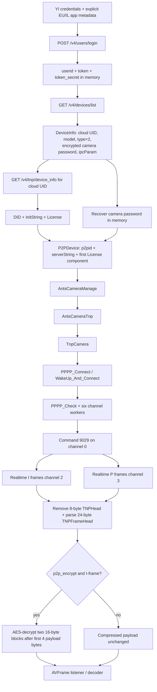

# TNP architecture and object flow

## End-to-end object trace

The type-2 path is separate from `AntsCameraTutk`/`TutkCamera`. Its proven
construction chain is:

```text
/v4/devices/list
  -> com.ants360.yicamera.db.j parses DeviceInfo
  -> db.j.P() refreshes /v4/tnp/device_info
  -> DeviceInfo.c() builds P2PDevice
  -> AntsCameraManage.getAntsCamera()
  -> AntsCameraTnp
  -> TnpCamera
  -> PPPP_Connect or PPPP_WakeUp_And_Connect
```

`P2PDevice.getDeviceType()` recognizes a TNP identity when it starts with
`TNP` and has three hyphen-separated pieces. Every production device observed
in Phase 2A met that type-2 interpretation.

## `DeviceInfo` to `P2PDevice`

The decompiled field names are partly obfuscated. The constructor call in
`DeviceInfo.c()` and the Room schema establish the following mapping:

| `P2PDevice` input | `DeviceInfo` source | Origin |
|---|---|---|
| `uid` | `f7473c` | `/v4/devices/list.uid` |
| `p2pid` | `e` | refreshed `tnp/device_info.DID`; initially the cloud UID |
| `account` | empty string | `P2PDevice` normalizes it to `admin` |
| `password` | `i` | decrypted camera password, only in memory |
| `type` | `w` | type 2 for TNP |
| `serverString` | `x` | `tnp/device_info.InitString` |
| `licenseDeviceKey` | `d()` | first colon-delimited component of `License` stored in `y` |
| `model` | normalized model field | feature-config lookup |
| `isEncrypted` | `P` | `ipcParam.p2p_encrypt` |
| `utcOffset` | derived setting | timezone offset |
| `tnpHeaderVersion` | literal zero | means detect; not supplied by cloud |
| `wakeup` | `ay` | `ipcParam.wakeup` |
| `forceRelay` | local setting/model rule | not a cloud credential |

The `P2PDevice` can later receive local `p2pMode`, `relayRatio`, and `netType`
history. These tune direct-versus-relay selection; they do not replace DID,
server string, license device key, or camera authentication.

## Camera construction

`AntsCameraManage.getAntsCamera()` caches cameras by cloud UID and selects
`AntsCameraTnp` when type is 2. If refreshed TNP server/key values differ, it
updates the existing camera instead of constructing a TUTK camera.

`AntsCameraTnp` passes these 15 values to `TnpCamera` in order:

```text
uid, p2pid, serverString, licenseDeviceKey,
account, password, model, isEncrypted, isByteOrderBig,
p2pMode, relayRatio, netType, tnpHeaderVersion, wakeup, forceRelay
```

For type 2, `AntsCamera.isByteOrderBig()` returns true. This controls the TNP
header and command-field byte order. The camera password is also used to build
the 16-byte AES key `password + "0"` for encrypted media.

## Connection lifecycle

`TnpCamera.connect()` runs a single connection task and creates a seven-character
nonce prefix. The connection runnable chooses a direct or forced-relay mode:

```text
direct policy value = 5  -> flag (5 << 1) | 1 | 64 = 75 (0x4B)
relay policy value  = 15 -> flag (15 << 1) | 1 | 64 = 95 (0x5F)
```

It then calls one of:

```text
PPPP_Connect(p2pid, flag, 0, serverString, licenseDeviceKey)
PPPP_WakeUp_And_Connect(p2pid, flag, 0, serverString, licenseDeviceKey)
```

`wakeup` selects the second form. A non-negative return is the session handle.
The runnable calls `PPPP_Check(handle, session)` and starts the command, audio,
realtime-video, and playback-video worker threads. The official TNP path does
not call `PPPP_SendLogin`; its application authentication is in every TNP
IO-control header.

Disconnect stops the workers, calls `PPPP_Connect_Break(p2pid)`, then
`PPPP_ForceClose(handle)`, and invalidates the handle. `PPPP_Close` is exported
but is not used in this `TnpCamera` disconnect path.

## Full proven flow



No node after `TnpCamera` construction was exercised against the live camera in
Phase 2B; native and wire behavior above is established by static analysis.

## Implementation strategies

| Strategy | Description | Advantages | Blocking costs / risks |
|---|---|---|---|
| A. Direct TNP protocol implementation | Implement the documented TNP command/media layer on top of a working PPPP transport. | Small surface; wire behavior can be tested independently; preserves compressed frames. | Still requires a PPPP/Kalay transport; header version and stream framing need one controlled capture. |
| B. Reuse packaged ARM native libraries | Run the official Java/JNI contract with the APK's ARM32/ARM64 `libPPPP_API.so`, likely in Android or an ARM Android-compatible sidecar. | Closest behavioral oracle and fastest path to validate static findings. | Android-linked binaries, proprietary licensing, ARM-only architecture, JNI/runtime dependencies, poor fit for ordinary x86-64 Linux containers. |
| C. Portable Linux reimplementation | Implement PPPP transport plus TNP framing/auth/media in a portable library and expose a narrow frame API. | Correct long-term deployment shape for containers and multiple CPU architectures. | Highest effort and interoperability risk; PPPP transport remains substantially less documented than the TNP application layer. |

The smallest defensible next step is an isolated ARM/Android validation harness
using strategy B only as a behavioral oracle, then a protocol test harness for
strategy A. A production bridge should target strategy C. The proprietary ARM
library should not be assumed redistributable or Linux-compatible merely
because its C symbols are exported.

## Evidence locations

- Device parsing and TNP metadata refresh:
  `.analysis/jadx/sources/com/ants360/yicamera/db/j.java`
- `DeviceInfo` construction:
  `.analysis/jadx/sources/com/ants360/yicamera/bean/DeviceInfo.java`
- P2P descriptor: `.analysis/jadx/sources/com/xiaoyi/camera/sdk/P2PDevice.java`
- camera selection:
  `.analysis/jadx/sources/com/xiaoyi/camera/sdk/AntsCameraManage.java`
- type-2 adapter:
  `.analysis/jadx/sources/com/xiaoyi/camera/sdk/AntsCameraTnp.java`
- TNP implementation: `.analysis/jadx/sources/com/tnp/TnpCamera.java`
